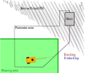

# Optional perimeter usage

The main feature of OpenMower is smart mowing using RTK GPS. But the perimeter wire may still be useful. For example, if your docking station is placed in an area with bad GPS signals, as shown here:

During docking RTK GPS will be used to approach the perimeter wire. Once found, the mower will follow the wire without need for GPS until it hits the docking station. During undocking the mower will follow the perimeter wire for a given number of meters. Then it will stop, wait for a RTK fix and start mowing.

## Hardware requirements

In your Mowgli setup, do not remove the perimeter board and keep the cable attached (the one, that connects to jumper "SIGNAL").

## Firmware building

Make sure, that

    #define OPTION_PERIMETER

is set in Mowgli's `board.h` (or `-DOPTION_PERIMETER` in `platform.ini`). It should cause no harm to define it, if you do not intend to use it or even do not have perimeter sensors connected.

## Configuration

In order to activate perimeter usage add the following setting to your `mower_config.sh`

    # Uncomment, if you want to use the perimeter sensor of your Mowgli-type mower
    # for docking. Set it to 1 or 2 dependig on the signal selected on the docking
    # station (S1 or S2).
    # Normally docking is done counterclockwise. If you want to dock clockwise set
    # it to -1 or -2.
    # Also set OM_UNDOCK_DISTANCE to the distance, that should be travelled along
    # the wire. If this value is less than one meter, normal undocking will be used.
    OM_PERIMETER_SIGNAL=1
    OM_UNDOCK_DISTANCE=10.0

## Usage

The aproach to the perimeter wire has to be recorded. Therefore you have to open OpenMower's **Area recording**. Navigate the mower to a point about three meters away from the perimeter wire. This point should be inside a Navigation or Mowing Area and it should be located inside the perimeter wire. Now start **Record Docking**. Navigate into a direction, that will cross the perimeter wire, but stop about 0.5 meters in front of the perimeter and mark this point by clicking **Record docking** again. Done!